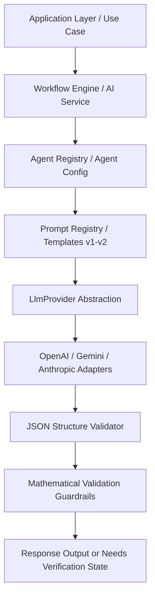

# MathOSN Coach AI Platform, Prompt Architecture & Multi-Agent System

This document outlines the decoupled, multi-agent AI Platform designed to support structured extractions, tutoring feedback, and administrative controls within the MathOSN Coach application.

---

## 1. AI Architecture Diagram



---

## 2. Agent Inventory (19 Specialized Nodes)

Each agent is defined with a single, dedicated cognitive responsibility inside [AgentRegistry.ts](file:///d:/Coding/OSNCoachAI/src/infrastructure/services/ai/AgentRegistry.ts):

1. **PDFImportAgent**: Extracts raw text pages and coordinate offsets from PDF documents.
2. **OCRValidationAgent**: Flags uncertain visual inputs and highlights low-confidence text segments.
3. **QuestionExtractionAgent**: Extracts question body, type (MCQ/Short Answer), and explanations.
4. **DiagramDetectionAgent**: Audits layout coordinates to flag math diagram boundaries.
5. **QuestionClassificationAgent**: Validates alignment with curriculum syllabus requirements.
6. **DifficultyAnalyzer**: Evaluates question logic steps to assign difficulty levels (`EASY`, `MEDIUM`, `HARD`).
7. **TopicClassifier**: Classifies questions into specific categories (Algebra, Combinatorics, Geometry, logic).
8. **HintGenerator**: Creates Socratic step-by-step math hints (does not reveal answers).
9. **SolutionGenerator**: Generates detailed, child-friendly explanations.
10. **MathTutor**: Orchestrates guiding discussions during interactive chat attempts.
11. **MathCoach**: Reinforces a growth-mindset through encouraging motivational flags.
12. **DiscussionAgent**: Handles study lobby peer conversations.
13. **WeaknessAnalyzer**: Identifies concept error patterns over historical solve timelines.
14. **LearningAdvisor**: Recommends personalized syllabus path steps.
15. **QuestionGenerator**: Creates new math problems fitting target tags.
16. **QuestionReviewer**: Conducts peer reviews on generated problems.
17. **KnowledgeGraphBuilder**: Links math concepts together (e.g., matching primes with factors).
18. **ParentReportGenerator**: Formats complex analytics into friendly parent progress updates.
19. **ProgressSummaryAgent**: Summarizes daily quest metrics and streak gains.

---

## 3. Centralized Prompt Inventory & Templating

Prompts are versioned and registry-managed in [PromptRegistry.ts](file:///d:/Coding/OSNCoachAI/src/infrastructure/services/ai/PromptRegistry.ts):

- **`ocr-extract`**: Version `v1`. System prompt instructs the model to output strict structured JSON.
- **`difficulty-analyze`**: Version `v1`. Determines the Olympiad difficulty rating based on solution complexity.
- **`topic-classify`**: Version `v1`. Performs syllabus classification.
- **`hint-generate`**: Version `v1`. Prompts the LLM as a friendly Socratic coach.

### Prompt Template Example (Socratic Coach)
```markdown
Role: Socratic AI Coach helping an 11-year-old student.
Objective: Guide the student toward finding the correct solution themselves.
Rules:
- NEVER give the final answer.
- Highlight the first logical step.
- Use encouraging, age-appropriate language.

User Variables:
Question: {{questionBody}}
Attempt: {{studentAnswer}}
```

---

## 4. Safety Guardrails & Validation Strategy

1. **Prompt Injection Blocker**: Sanitizes inputs for bypass phrases (e.g., "ignore previous instructions").
2. **JSON Schema Validator**: Enforces strict typings. If required keys are missing, the executor triggers a retry.
3. **Mathematical Consistency Checker**: Validates arithmetic statements. If the question states `5 + 5` but the extracted answer is `12`, the validation confidence score is reduced.
4. **Fallback to Verification**: If validation confidence drops below `0.70`, the system returns `"Needs Verification"`.

---

## 5. Cost Optimization & Observability

- **Model Routing Rules**:
  - *Cheap / Fast* (e.g. `gpt-4o-mini`): Handles classification, difficulty evaluation, and tag tagging.
  - *Advanced / Large context* (e.g. `gpt-4o`): Handles complex question extractions and PDF layouts.
- **Cost Tracking**: Logs prompt/completion tokens and estimates monthly and average costs per feature, visible on the [AI Dashboard](file:///d:/Coding/OSNCoachAI/src/app/parent/ai-dashboard/page.tsx).

---

## 6. Folder Structure

```
src/
├── domain/
│   └── services/
│       └── ai/
│           ├── LlmProvider.ts (Interface for LLM integration)
│           ├── Prompt.ts      (Prompt schema and rendering rules)
│           └── Agent.ts       (Agent contracts and output schemas)
└── infrastructure/
    └── services/
        └── ai/
            ├── LlmProviderRegistry.ts (OpenAI & Mock providers, cost tracking)
            ├── PromptRegistry.ts      (Centralized prompt version database)
            ├── AgentRegistry.ts       (Profile registry for all 19 agents)
            ├── AiValidator.ts         (Structured JSON and math validations)
            └── WorkflowEngine.ts      (Worksheet extraction agent pipeline)
```

---

## 7. Future Expansion Roadmap

1. **Provider Adapters**: Add concrete adapters for Anthropic (Claude) and Google (Gemini) APIs.
2. **Vector Memory**: Connect a vector database (e.g. Supabase pgvector) to enable long-term student memory.
3. **A/B Testing Benchmarks**: Enable prompt playground comparisons, routing student cohorts to test prompt changes.
